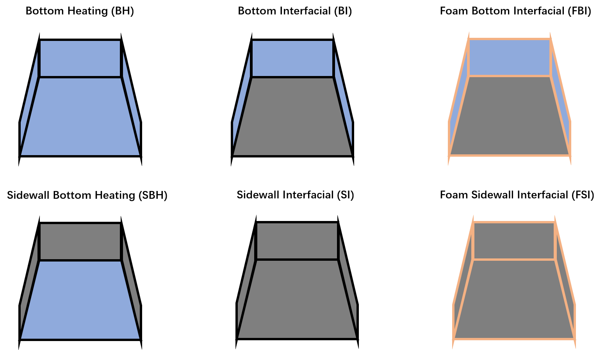

```{r setup, include=FALSE}
knitr::opts_chunk$set(echo = TRUE)
```

### Solar Still Types

Different types of solar stills were designed and constructed by the research group, and most of the data was collected on the roof of Zheneng Chuangye Building, Hangzhou. The shape, insulation, absorption and evaporation structure of stills were improved:

- **Trapezoid Solar Still**
  + **Bottom Heating (BH):** Traditional solar still as control group
  + **Sidewall Bottom Heating (SBH):** Traditional solar still as control group for sidewall factor investigation
  + **Bottom Interfacial (BI):** Interfacial evaporation structure only on bottom
  + **Sidewall Bottom Interfacial (SI):** Interfacial evaporation structure on both bottom & sidewall
  + **Foam Bottom Interfacial (FBI):** Foam inside structure with interfacial evaporation on bottom
  + **Foam Sidewall Bottom Interfacial (FSI):** Foam inside structure with interfacial evaporation on both bottom & sidewall
- **Stepwised Solar Still**
- **Pyramid Solar Still**
- **Tube Solar Still**
- **Portable Solar Still**

<div align=center>

### A Glimpse to Solar Still Daily Desalination Performance

Solar stills were arranged and placed on the roof facing south direction. Distilled water was collected in a graduated cylinder to measure its volume. Distilled water was poured back into the still chamber at the sunset (17:00~18:00) or at the sunrise (8:00~9:00). Further automatic water collecting and pumping system would be introduced soon, refreshing the sea water at midnight. Solar radiation intensity and other evironmental weather data were collected by meteorological equipments located on the same roof.  

#### Solar Stills' Daily Water Production and Solar Radiation Energy

**Figure 2. The plot of daily solar still water production energy and solar radiation energy** was shown below (daily water production was converted into its evaporation energy by multiplying water evaporation enthalpy):  
**Hint:** It's an interactive graph! You can slide the bottom Date range and mute/show the still data by clicking its label

```{r, warning=FALSE, echo=FALSE, message=FALSE}
setwd("D:/R/Solar Still")
library(lubridate)
Still_BottomInter <- read.csv(file = "Bottom Interfacial Solar Still Daily Water Production.csv", header = TRUE, stringsAsFactors = FALSE)
Still_SidewallInter <- read.csv(file = "Sidewall Interfacial Solar Still Daily Water Production.csv", header = TRUE, stringsAsFactors = FALSE)
Still_FoamBottomInter <- read.csv(file = "Foam Bottom Interfacial Solar Still Daily Water Production.csv", header = TRUE, stringsAsFactors = FALSE)
Still_BottomHeat <- read.csv(file = "Bottom Heating Solar Still Daily Water Production.csv", header = TRUE, stringsAsFactors = FALSE)
Still_SidewallHeat <- read.csv(file = "Sidewall Bottom Heating Solar Still Daily Water Production.csv", header = TRUE, stringsAsFactors = FALSE)
Still_FoamSidewallInter <- read.csv(file = "Foam Sidewall Interfacial Solar Still Daily Water Production.csv", header = TRUE, stringsAsFactors = FALSE)
StillNames <- c("Bottom_Heating", "Sidewall_Bottom_Heating", "Bottom_Interfacial", "Foam_Bottom_Interfacial", "Sidewall_Interfacial", "Foam_Sidewall_Interfacial")

SolarEnv_Day <- read.csv(file = "CR1000_BSRN1000_Day201116.csv", skip = 1, stringsAsFactors = FALSE)
SolarEnv_Day <- SolarEnv_Day[c(-1, -2), ] ##Delete two rows of unit
SolarEnv_Day$TIMESTAMP <- as.Date(ymd_hms(SolarEnv_Day$TIMESTAMP))
SolarEnv_Day$TIMESTAMP <- SolarEnv_Day$TIMESTAMP - ddays(1)
SolarEnv_Day$TIMESTAMP <- as.character(SolarEnv_Day$TIMESTAMP)
SolarEnv_Day[, 2:39] <- lapply(SolarEnv_Day[, 2:39], as.numeric)

library(dplyr)
WaterProduction_Energy <- Still_BottomHeat[, c("TIMESTAMP", "Global_Energy_Tot", "Water_Energy")] %>% 
  full_join(Still_SidewallHeat[, c("TIMESTAMP", "Water_Energy")], by = "TIMESTAMP") %>% 
  full_join(Still_BottomInter[, c("TIMESTAMP", "Water_Energy")], by = "TIMESTAMP") %>% 
  full_join(Still_FoamBottomInter[, c("TIMESTAMP", "Water_Energy")], by = "TIMESTAMP") %>% 
  full_join(Still_SidewallInter[, c("TIMESTAMP", "Water_Energy")], by = "TIMESTAMP") %>%
  full_join(Still_FoamSidewallInter[, c("TIMESTAMP", "Water_Energy")], by = "TIMESTAMP")
names(WaterProduction_Energy) <- c("Date", "Solar_Radiation", StillNames)
WaterProduction_Efficiency <- Still_BottomHeat[, c("TIMESTAMP", "Global_Efficiency")] %>% 
  full_join(Still_SidewallHeat[, c("TIMESTAMP", "Global_Efficiency")], by = "TIMESTAMP") %>% 
  full_join(Still_BottomInter[, c("TIMESTAMP", "Global_Efficiency")], by = "TIMESTAMP") %>% 
  full_join(Still_FoamBottomInter[, c("TIMESTAMP", "Global_Efficiency")], by = "TIMESTAMP") %>% 
  full_join(Still_SidewallInter[, c("TIMESTAMP", "Global_Efficiency")], by = "TIMESTAMP") %>% 
  full_join(Still_FoamSidewallInter[, c("TIMESTAMP", "Global_Efficiency")], by = "TIMESTAMP") %>% 
  left_join(SolarEnv_Day[, c("TIMESTAMP", "Global_Energy_Tot", "Direct_Energy_Tot", "Diffuse_Energy_Tot")], by = "TIMESTAMP")
names(WaterProduction_Efficiency) <- c("Date", StillNames, "Solar_Energy", "Direct_Energy", "Diffuse_Energy")
Direct_Efficiency <- WaterProduction_Efficiency[WaterProduction_Efficiency$Direct_Energy >= 1, ]
Diffuse_Efficiency <- WaterProduction_Efficiency[WaterProduction_Efficiency$Direct_Energy < 1, ]
fit_Efficiency <- Still_BottomHeat[, c("TIMESTAMP", "fit_Efficiency")] %>% 
  full_join(Still_SidewallHeat[, c("TIMESTAMP", "fit_Efficiency")], by = "TIMESTAMP") %>% 
  full_join(Still_BottomInter[, c("TIMESTAMP", "fit_Efficiency")], by = "TIMESTAMP") %>% 
  full_join(Still_FoamBottomInter[, c("TIMESTAMP", "fit_Efficiency")], by = "TIMESTAMP") %>% 
  full_join(Still_SidewallInter[, c("TIMESTAMP", "fit_Efficiency")], by = "TIMESTAMP") %>% 
  full_join(Still_FoamSidewallInter[, c("TIMESTAMP", "fit_Efficiency")], by = "TIMESTAMP") %>% 
  left_join(SolarEnv_Day[, c("TIMESTAMP", "Global_Energy_Tot", "Direct_Energy_Tot", "Diffuse_Energy_Tot")], by = "TIMESTAMP")
names(fit_Efficiency) <- c("Date", StillNames, "Solar_Energy", "Direct_Energy", "Diffuse_Energy")

library(reshape2)
Water_Energy <- melt(WaterProduction_Energy, id = "Date")
Water_Energy$Date <- ymd(Water_Energy$Date)
Water_Eff <- melt(WaterProduction_Efficiency, id = "Date")
Water_Eff$Date <- ymd(Water_Eff$Date)
Solar_Eff <- melt(WaterProduction_Efficiency[, c("Solar_Energy", StillNames)], id = "Solar_Energy")
names(Solar_Eff) <- c("Solar_Energy", "Still_Types", "Energy_Efficiency")
Direct_Eff <- melt(Direct_Efficiency[, c("Direct_Energy", StillNames)], id = "Direct_Energy")
Diffuse_Eff <- melt(Diffuse_Efficiency[, c("Diffuse_Energy", StillNames)], id = "Diffuse_Energy")
Total_eff <- melt(WaterProduction_Efficiency[, c("Solar_Energy", "Direct_Energy", "Diffuse_Energy", StillNames)], id = c("Solar_Energy", "Direct_Energy", "Diffuse_Energy"))
names(Total_eff) <- c("Solar_Energy", "Direct_Energy", "Diffuse_Energy", "Still_Type", "Efficiency")
fit_Eff <- melt(fit_Efficiency[, c("Solar_Energy", StillNames)], id = "Solar_Energy")

library(plotly)

```

```{r, out.width="100%", warning=FALSE, echo=FALSE, message=FALSE}
StillEnergy_plotly <- plot_ly(WaterProduction_Energy, x = ~Date, y = ~Solar_Radiation, type = 'bar', name = 'Solar Radiation') %>%
  add_trace(y = ~Bottom_Heating, name = 'Bottom Heating') %>%
  add_trace(y = ~Sidewall_Bottom_Heating, name = 'Sidewall Bottom Heating') %>%
  add_trace(y = ~Bottom_Interfacial, name = 'Bottom Interfacial') %>%
  add_trace(y = ~Foam_Bottom_Interfacial, name = 'Foam Bottom Interfacial') %>%
  add_trace(y = ~Sidewall_Interfacial, name = 'Sidewall Interfacial') %>%
  add_trace(y = ~Foam_Sidewall_Interfacial, name = 'Foam Sidewall Interfacial') %>%
  layout(
    yaxis = list(title = 'Energy/kWh'), 
    xaxis = list(
      rangeselector = list(
        buttons = list(
          list(
            count = 3,
            label = "3 mo",
            step = "month",
            stepmode = "backward"),
          list(
            count = 6,
            label = "6 mo",
            step = "month",
            stepmode = "backward"),
          list(
            count = 1,
            label = "1 yr",
            step = "year",
            stepmode = "backward"),
          list(
            count = 1,
            label = "YTD",
            step = "year",
            stepmode = "todate"),
          list(step = "all"))),
      rangeslider = list(type = "date")),
    barmode = 'group')
StillEnergy_plotly
```

**Results:**   
Sunny day's solar radiation energy reached high (7~8 kWh) in July and August, and so did the solar still water production energy. It rained a lot in June and September, thus small amount of water was collected in those times.


#### Solar Stills' Daily Energy Efficiency vs Solar Radiation Energy

Since the weather and solar radiation were different every day, solar stills' energy efficiencies displayed randomly by date. Thus we could differ the energy efficiency of different solar stills by daily solar radiation energy, despited of the climate and weather change.  
**Figure 3. The plot of solar still daily water production energy efficiency vs solar radiation energy** was shown below (the loess smoothing was conducted to each solar still respectively):  
**Hint:** It's an interactive graph! You can mute/show the still data and its smoothing line by clicking its label.  

```{r, out.width="100%", warning=FALSE, echo=FALSE, message=FALSE}
SolarEff <- ggplot(Solar_Eff, aes(Solar_Energy, Energy_Efficiency*100, color = Still_Types)) +
  geom_point(alpha = 1/3) + geom_smooth(method="loess",se=FALSE) + 
  labs(x = "Solar Energy/kWh", y = "Efficiency/%") + scale_y_continuous(limits = c(10,60), breaks=seq(0,60,5))
ggplotly(SolarEff, height = 600) 
```

**Results:** 

1. The solar still's energy efficiency increased while the daily solar radiation energy increased.
2. The increase rate of energy efficiency was limited after daily solar radiation reached high. (It's because of salt aggregation occured on the evaporation interface of interfacial evaporation solar stills. )
3. Comparing Bottom Heating solar stills with Interfacial Evaporation ones, there's no significant difference on desalination performance between these two evaporation structures.
4. The foam lining FBI and FSI solar stills' energy efficiencies were leading in almost all solar radiation condition.
5. Sidewall black wick modified solar stills performed better than not modified ones on both bottom heating and interfacial evaporation structures. However, there's no obvious inprovement on foam lining solar still pairs.

#### Solar Stills' Daily Energy Efficiency in Different Weather Condition

The energy efficiency scattered widely along the "Efficiency ~ Solar Radiation" plot, which indicated there were a lot of other factors affecting the solar still's efficiency. Here we put an example to show how the Direct Radiation and the Diffuse Radiation components in Solar Radiation would affect the solar stills' energy efficiency. Further multiple factor analysis and simulation would be conducted by machine learning methods.  
**Figure 4. 3D plot of solar still daily water production energy efficiency vs direct solar radiation and diffuse solar radiation** was shown below:  
**Hint:** It's an interactive graph! You can mute/show the still data dots by clicking its label, you can also spin or expand the plot by your mouse.  

```{r, out.width="100%", warning=FALSE, echo=FALSE, message=FALSE}
DirDiffEff_plotly <- plot_ly(Total_eff, x = ~Direct_Energy, y = ~Diffuse_Energy, z = ~Efficiency*100, color = ~Still_Type, type = 'scatter3d') %>%
  layout(scene = list(xaxis = list(title = "Direct Energy/kWh"),
                      yaxis = list(title = "Diffuse Energy/kWh"),
                      zaxis = list(title = "Energy Efficiency/%")))
DirDiffEff_plotly
```

**Results:** 

1. The solar radiation was consisted of direct and diffuse radiation, which ranged from 0~8 kWh and 1~4 kWh respectively. The direct radiation would drop to zero in rainy or cloudy days, left other solar radiation as diffuse radiation. As direct radiation increased in sunny days, diffuse radiation was in a negative trend.
2. The interfacial evaporation solar still's energy efficiency increased when the diffuse radiation energy increased, however, it jumped to a high value and increased slightly when the direct radiation energy started to increase. The latter result was not true for the bottom heating solar stills, whose energy efficiency increase obviously when the direct radiation increased.

According to the 3D plot, we assumed that direct radiation and duffuse radiation had different ability to improve the solar still's energy efficiency. To confirm our assumptions, we conducted a simple multiple linear regression simulation to energy efficiency with direct and diffuse radiation.

```{r, echo=FALSE}
mlrcoef <- function(DirDiffStill){
  fit <- lm(Global_Efficiency ~ Direct_Energy_Tot + Diffuse_Energy_Tot, data = na.omit(DirDiffStill))
  output <- c(coef(fit)[1], coef(fit)[2], coef(fit)[3], summary(fit)$r.squared)
  names(output) <- c("Intercept", "Direct_Coef", "Diffuse_Coef", "R_squred")
  return(output)
}
DirDiffCoef <- rbind(mlrcoef(Still_BottomHeat), 
                     mlrcoef(Still_SidewallHeat), 
                     mlrcoef(Still_BottomInter), 
                     mlrcoef(Still_FoamBottomInter), 
                     mlrcoef(Still_SidewallInter), 
                     mlrcoef(Still_FoamSidewallInter))
rownames(DirDiffCoef) <- StillNames
DirDiffCoef
```

According to the coefficients table, the direct radiation coefficient is smaller than diffuse ones. However in some solar stills, multiple linear model fitted not well according to their R-squreds.

We could also visualize this assumption by dividing solar radiation into three different weathers: Overcast, Cloudy, and Sunny days, which were quantified by Direct/Diffuse energy ratio as "<0.1", "from 0.1 to 1", and ">1".  
**Figure 5. Plot array of solar stills' daily water production energy efficiency vs solar radiation in different weather condition** were shown below:  
**Hint:** It's an interactive graph! You can mute/show the dots and lines by clicking their labels. 

```{r, out.width="100%", warning=FALSE, echo=FALSE, message=FALSE}
Weatherfit <- function(StillData){
  DirDiffStill <- StillData[, c("Global_Energy_Tot", "Global_Efficiency")]
  DirDiffStill$DirDiffRatio <- StillData$Direct_Energy_Tot/StillData$Diffuse_Energy_Tot
  DirDiffStill$Weather <- cut(DirDiffStill$DirDiffRatio, breaks = c(min(na.omit(DirDiffStill$DirDiffRatio)), 0.1, 1, max(na.omit(DirDiffStill$DirDiffRatio))), labels = c("Overcast (Dir./Diff. < 0.1)", "Cloudy (0.1 < Dir./Diff. < 1)", "Sunny (Dir./Diff. > 1)"))
  return(DirDiffStill)
}
Still_DirDiff <- rbind(cbind(Weatherfit(Still_BottomHeat), StillType = "Bottom_Heating"), 
                       cbind(Weatherfit(Still_SidewallHeat), StillType = "Sidewall_Bottom_Heating"),                        cbind(Weatherfit(Still_BottomInter), StillType = "Bottom_Interfacial"), 
                       cbind(Weatherfit(Still_FoamBottomInter), StillType = "Foam_Bottom_Interfacial"), 
                       cbind(Weatherfit(Still_SidewallInter), StillType = "Sidewall_Interfacial"), 
                       cbind(Weatherfit(Still_FoamSidewallInter), StillType = "Foam_Sidewall_Interfacial")) 

ggplot_DirDiff <- ggplot(data = na.omit(Still_DirDiff), aes(Global_Energy_Tot, Global_Efficiency*100, color = Weather)) + 
  geom_point() + geom_smooth(method = "lm", se = FALSE) + scale_y_continuous(breaks=seq(0,60,5)) + 
  labs(x = "Solar Energy/kWh", y = "Efficiency/%") + facet_wrap(. ~StillType, ncol = 2 )
ggplotly(ggplot_DirDiff, height = 700)
```

**Results:** 

1. As for the energy efficiency in different weather conditions, especially for the overlapping region while solar energies were almost the same, the solar stills' energy efficiencies in sunny days were better than those in cloudy days, which were better than in overcast days. 
2. In most of solar stills, as solar radiation increased, the energy efficiency increased a lot in overcast days and cloudy days, but increase slightly in sunny days.

### A Glimpse to Solar Still Hourly Desalination Energy Efficiency

We also conducted hourly desalination water production collection in day time (from 8 a.m. to 5 p.m.). Sometimes the data collection interval time was two or three hours because of busy working. In cloudy days or rainy days as well as weekends, hourly water production collection was not conducted. Solar radiation intensity and other evironmental weather data were collected in minutes by meteorological equipments. Further automatic water collecting and pumping system would be introduced to collect water production collection in minutes all over the day too.  

#### Solar Stills' Hourly Water Production Percentage Over the Day

Solar energy was rising and droping from morning to evening, while desalination water production followed the same principle, however with a delay from minutes to hours. Here we normalized the solar energy and water productions over the day, showed the accumulated percentages of solar energy received and water produced in each hour for every solar stills.  
**Figure 6. Normalized plot of solar stills' water production percentages and solar radiation percentages in one day** were shown below, and the binomial simulation was used:  
**Hint:** It's an interactive graph! You can mute/show the dots and lines by clicking their labels. 

```{r, warning=FALSE, echo=FALSE, message=FALSE}
##Get solar still water hourly production data
setwd("D:/R/Solar Still")
library(lubridate)
library(dplyr)
data_record <- as.Date("2020-06-05")
energy_record <- 5
power_record <- 0

SolarEnv_Day <- read.csv(file = "CR1000_BSRN1000_Day201116.csv", skip = 1, stringsAsFactors = FALSE)
SolarEnv_Day <- SolarEnv_Day[c(-1, -2), -(24:39)] ##Delete two rows of unit, 24-39 colunm
SolarEnv_Day$TIMESTAMP <- as.Date(ymd_hms(SolarEnv_Day$TIMESTAMP))
SolarEnv_Day <- SolarEnv_Day[SolarEnv_Day$TIMESTAMP >= data_record, ]
SolarEnv_Day$Date <- SolarEnv_Day$TIMESTAMP - ddays(1)
SolarEnv_Day[, 2:23] <- lapply(SolarEnv_Day[, 2:23], as.numeric)
Solar_climate <- read.csv(file = "CR1000_BSRN1000_Min201116.csv", skip = 1, stringsAsFactors = FALSE)
Solar_climate <- Solar_climate[c(-1, -2), -c(2, 14:19)] ##Delete two rows of unit, useless columns
Solar_climate$TIMESTAMP <- ymd_hms(Solar_climate$TIMESTAMP)
Solar_climate <- Solar_climate[date(Solar_climate$TIMESTAMP) >= data_record, ]
Solar_climate[, 2:length(Solar_climate)] <- lapply(Solar_climate[, 2:length(Solar_climate)], as.numeric)

cleandata <- function(SolarWater){
    hourlywater <- rbind(na.omit(SolarWater[2:length(SolarWater[, 1]), 1:2]), c("23:59", SolarWater[1, 2]))
    names(hourlywater) <- c("Time", "WaterProduction")
    hourlywater <- hourlywater[hourlywater$WaterProduction != 0, ]
    hourlywater <- rbind(c("0:00", 0), hourlywater)
    hourlywater$WaterProduction <- as.numeric(hourlywater$WaterProduction)
    hourlywater$Date <- ymd(SolarWater[1, 1])
    hourlywater$Percentage <- hourlywater$WaterProduction*100/hourlywater$WaterProduction[length(hourlywater$WaterProduction)]
    for(i in 2:(length(SolarWater)/2)){
    hourdata <- rbind(na.omit(SolarWater[2:length(SolarWater[, (2*i-1)]), (2*i-1):(2*i)]), c("23:59", SolarWater[1, (2*i)]))
    names(hourdata) <- c("Time", "WaterProduction")
    hourdata <- hourdata[hourdata$WaterProduction != 0, ]
    hourdata <- rbind(c("0:00", 0), hourdata)
    hourdata$WaterProduction <- as.numeric(hourdata$WaterProduction)
    hourdata$Date <- ymd(SolarWater[1, (2*i-1)])
    hourdata$Percentage <- hourdata$WaterProduction*100/hourdata$WaterProduction[length(hourdata$WaterProduction)]
    hourlywater <- rbind(hourlywater, hourdata)
  }
  hourlywater <- hourlywater[hourlywater$Date >= data_record, ]
  hourlywater$Time <- hm(hourlywater$Time)
  hourlywater$WaterProduction <- as.numeric(hourlywater$WaterProduction)*4/1000
  hourlywater$WaterEnergy <- hourlywater$WaterProduction/1.5
  hourlywater <- hourlywater[(hourlywater$Date + hourlywater$Time) %in% Solar_climate$TIMESTAMP, ]
  hourlywater$SolarEnergy <- as.numeric(Solar_climate$Global_Energy_Day[Solar_climate$TIMESTAMP %in% (hourlywater$Date + hourlywater$Time)])
  hourlywater$DeltaTime <- c(0, time_length(int_diff(hourlywater$Date + hourlywater$Time), "hours"))
  hourlywater$DeltaSolarEnergy <- c(0, diff(hourlywater$SolarEnergy))
  ##Set delta solar energy < 0 data = 0
  hourlywater$DeltaSolarEnergy[hourlywater$DeltaSolarEnergy < 0] <- 0
  hourlywater$DeltaWaterEnergy <- c(0, diff(hourlywater$WaterEnergy))
  ##Set delta water energy < 0 data = 0
  hourlywater$DeltaWaterEnergy[hourlywater$DeltaWaterEnergy < 0] <- 0
  #hourlywater$TransPercentage <- hourlywater$DeltaWaterEnergy/hourlywater$WaterEnergy
  hourlywater$AvgEfficiency <- hourlywater$WaterEnergy/hourlywater$SolarEnergy*100
  hourlywater$TransSolarPower <- hourlywater$DeltaSolarEnergy/hourlywater$DeltaTime
  hourlywater$DirectEnergy <- as.numeric(Solar_climate$Direct_Energy_Day[Solar_climate$TIMESTAMP %in% (hourlywater$Date + hourlywater$Time)])
  hourlywater$DiffuseEnergy <- as.numeric(Solar_climate$Diffuse_Energy_Day[Solar_climate$TIMESTAMP %in% (hourlywater$Date + hourlywater$Time)])
  hourlywater$DeltaDirectEnergy <- c(0, diff(hourlywater$DirectEnergy))
  hourlywater$DeltaDirectEnergy[hourlywater$DeltaDirectEnergy < 0] <- 0
  hourlywater$DeltaDiffuseEnergy <- c(0, diff(hourlywater$DiffuseEnergy))
  hourlywater$DeltaDiffuseEnergy[hourlywater$DeltaDiffuseEnergy < 0] <- 0
  hourlywater$TransDirectPower <- hourlywater$DeltaDirectEnergy/hourlywater$DeltaTime
  hourlywater$TransDiffusePower <- hourlywater$DeltaDiffuseEnergy/hourlywater$DeltaTime
  hourlywater$TransEfficiency <- hourlywater$DeltaWaterEnergy/hourlywater$DeltaSolarEnergy*100
  hourlywater$DirDiffRatio <- hourlywater$TransDirectPower/hourlywater$TransDiffusePower
  hourlywater$DirDiff <- cut(hourlywater$DirDiffRatio, breaks = c(min(na.omit(hourlywater$DirDiffRatio)), 0.1, 1, max(na.omit(hourlywater$DirDiffRatio))), labels = c("Cloudy", "Between", "Clear"))
  ##fit Efficiency from 10% to 75%
  fit <- lm(TransEfficiency ~ TransDirectPower + TransDiffusePower, data = na.omit(hourlywater[(hourlywater$TransEfficiency < 75)&(hourlywater$TransEfficiency > 10), ]))
  hourlywater$FitEfficiency <- coefficients(fit)[1] + coefficients(fit)[2]*hourlywater$TransDirectPower + coefficients(fit)[3]*hourlywater$TransDiffusePower
  ##hourlywater$TransEfficiency[(hourlywater$TransEfficiency > 100)|(hourlywater$TransEfficiency == 0)] <- 100 ##Set unusual transient efficiency as 100
  ##hourlywater <- hourlywater[-which((hourlywater$TransEfficiency > 100)|(hourlywater$TransEfficiency == 0)), ] ##rule out data with unusual transient efficiency
  ##print(summary(fit))
  return(hourlywater)
}

SolarWater_FoamSidewallInter <- read.csv(file = "Foam Sidewall Interfacial Solar Still Water Production.csv", header = FALSE, stringsAsFactors = FALSE)
hourlywater_FoamSidewallInter <- cleandata(SolarWater_FoamSidewallInter)

SolarWater_FoamBottomInter <- read.csv(file = "Foam Bottom Interfacial Solar Still Water Production.csv", header = FALSE, stringsAsFactors = FALSE)
hourlywater_FoamBottomInter <- cleandata(SolarWater_FoamBottomInter)

SolarWater_SidewallInter <- read.csv(file = "Sidewall Interfacial Solar Still Water Production.csv", header = FALSE, stringsAsFactors = FALSE)
hourlywater_SidewallInter <- cleandata(SolarWater_SidewallInter)

SolarWater_BottomInter <- read.csv(file = "Bottom Interfacial Solar Still Water Production.csv", header = FALSE, stringsAsFactors = FALSE)
hourlywater_BottomInter <- cleandata(SolarWater_BottomInter)

SolarWater_SidewallHeat <- read.csv(file = "Sidewall Bottom Heating Solar Still Water Production.csv", header = FALSE, stringsAsFactors = FALSE)
hourlywater_SidewallHeat <- cleandata(SolarWater_SidewallHeat)

SolarWater_BottomHeat <- read.csv(file = "Bottom Heating Solar Still Water Production.csv", header = FALSE, stringsAsFactors = FALSE)
hourlywater_BottomHeat <- cleandata(SolarWater_BottomHeat)

meltcol <- function(colnames){
  mergecolselect <- rbind(rbind(rbind(rbind(rbind(
    cbind(hourlywater_BottomHeat[, colnames], Still = "Bottom_Heating"),
    cbind(hourlywater_SidewallHeat[, colnames], Still = "Sidewall_Bottom_Heating")), 
    cbind(hourlywater_BottomInter[, colnames], Still = "Bottom_Interfacial")), 
    cbind(hourlywater_FoamBottomInter[, colnames], Still = "Foam_Bottom_Interfacial")), 
    cbind(hourlywater_SidewallInter[, colnames], Still = "Sidewall_Interfacial")), 
    cbind(hourlywater_FoamSidewallInter[, colnames], Still = "Foam_Sidewall_Interfacial")) 
  return(mergecolselect)
}

hourlywater_Percentage <- meltcol(c("Time", "Percentage"))
hourlywater_Production <- meltcol(c("Time", "WaterProduction"))
hourlywater_AvgEfficiency <- meltcol(c("Time", "AvgEfficiency"))
hourlywater_TransEfficiency <- meltcol(c("Time", "TransEfficiency"))
hourlywater_PowerEfficiency <- meltcol(c("TransSolarPower", "TransEfficiency"))
hourlywater_DirectEfficiency <- meltcol(c("TransDirectPower", "TransEfficiency"))
hourlywater_DiffuseEfficiency <- meltcol(c("TransDiffusePower", "TransEfficiency"))
hourlywater_FitEfficiency <- meltcol(c("TransSolarPower", "FitEfficiency"))
 
hourlysolar <- Solar_climate[, c("TIMESTAMP", "Global_Energy_Day", "Direct_Energy_Day", "Diffuse_Energy_Day")]
hourlysolar$Date <- as.Date(date(hourlysolar$TIMESTAMP))
hourlysolar$Time <- as.numeric(hourlysolar$TIMESTAMP - as.POSIXct(hourlysolar$Date))/3600
hourlysolar <- hourlysolar[hourlysolar$Time %in% (hourlywater_Percentage$Time/hm("1:00")), ]
hourlysolar <- hourlysolar %>% left_join(SolarEnv_Day[, c("Date", "Global_Energy_Tot", "Direct_Energy_Tot", "Diffuse_Energy_Tot")], by = "Date")
hourlysolar <- hourlysolar[hourlysolar$Date != as.Date("2020-09-22"), ]
hourlysolar$GlobalPercentage <- hourlysolar$Global_Energy_Day/hourlysolar$Global_Energy_Tot
hourlysolar$DirectPercentage <- hourlysolar$Direct_Energy_Day/hourlysolar$Direct_Energy_Tot
hourlysolar$DiffusePercentage <- hourlysolar$Diffuse_Energy_Day/hourlysolar$Diffuse_Energy_Tot
hourlywater_solar <- na.omit(hourlysolar[, c("Time", "GlobalPercentage")])
hourlywater_solar <- with(hourlywater_solar, tapply(GlobalPercentage, as.factor(Time), mean))
hourlywater_solar <- cbind(as.data.frame.table(hourlywater_solar), Still = "Average_Solar_Radiation")
names(hourlywater_solar) <- names(hourlywater_Percentage)
hourlywater_solar$Percentage <- as.numeric(hourlywater_solar$Percentage) * 100
hourlywater_solar$Time <- as.numeric(as.character(hourlywater_solar$Time))
hourlywater_Percentage$Time <- hourlywater_Percentage$Time/hm("1:00")
hourlywater_Percentage <- rbind(hourlywater_Percentage, hourlywater_solar)
library(ggplot2)
library(plotly)
```

```{r, out.width="100%", warning=FALSE, echo=FALSE, message=FALSE}
PercentageBinomial <- ggplot(hourlywater_Percentage, aes(Time, Percentage/100, color = Still)) +
  geom_point(alpha = 0.1) + stat_smooth(method = "glm", method.args = list(family = binomial), se=FALSE) + 
  labs(x = "DayTime/0:00", y = "Normalized Percentage/100%") + scale_x_continuous(breaks=seq(0,24,2))
ggplotly(PercentageBinomial)
```

**Results:** 

1. The solar radiation was one hour and two hours ahead of the water production percentages of interfacial evaporation solar stills and those of bottom heating solar stills, respectively.
2. Sidewall modification expanded the whole curve, which means it produced more water in twilight condition. 

#### Solar Stills' Hourly Energy Efficiency Over the Day

Hourly average data or so called transient data was calculated to show the solar stills' dynamic performances over the day.  
**Figure 7. Plot of solar stills' transient energy efficiencies in one day** were shown below:  
**Hint:** It's an interactive graph! You can mute/show the dots and lines by clicking their labels. 

```{r, out.width="100%", warning=FALSE, echo=FALSE, message=FALSE}
TransEff <- ggplot(hourlywater_TransEfficiency, aes(Time/hm("1:00"), TransEfficiency, color = Still)) + 
  geom_point(alpha = 0.2) + geom_smooth(se = FALSE) + labs(x = "Time", y = "Hourly Transient Efficiency/%") + 
  scale_y_continuous(limits = c(10,70), breaks=seq(0,100,10)) + scale_x_continuous(limits = c(8,20), breaks=seq(0,24,2))
ggplotly(TransEff)
```

**Results:** 

1. The efficiency peaks of bottom heating solar stills appeared two hours later than those of interfacial evaporation solar stills. 
2. The efficiency peaks of sidewall modified solar stills appeared nearly one hour later than nonmodified ones, and their curve were also wider than nonmodified ones.

#### Solar Stills' Hourly Energy Efficiency vs Solar Power Over the Day

The peak of energy efficiency for each solar stills on the plot above was the average value at this time thoughout all days, which was not so presentative for solar stills' performance comparison. Thus we calculated the energy efficiency vs solar power to show the dynamic performances for solar stills. Because the bottom heating solar stills were time delayed too much to present their true dynamic solar energy efficiencies, so we deleted them on the plot.  
**Figure 8. Plot of interfacial evaporation solar stills' transient energy efficiencies vs solar power** were shown below:  
**Hint:** It's an interactive graph! You can mute/show the dots and lines by clicking their labels. 


```{r, out.width="100%", warning=FALSE, echo=FALSE, message=FALSE}
StillName_Interfacial <- c("Bottom_Interfacial", "Foam_Bottom_Interfacial", "Sidewall_Interfacial", "Foam_Sidewall_Interfacial")

PowerEff <- ggplot(hourlywater_PowerEfficiency[hourlywater_PowerEfficiency$Still %in% StillName_Interfacial, ], aes(TransSolarPower*1000, TransEfficiency, color = Still)) + 
  geom_point(alpha = 0.2) + geom_smooth(se = FALSE) + labs(x = "Solar Power/W", y = "Hourly Transient Efficiency/%") + 
  scale_y_continuous(limits = c(10,80), breaks=seq(0,100,10)) + scale_x_continuous(limits = c(100,1000), breaks=seq(0,1000,200))
ggplotly(PowerEff)
```

**Results:** 

1. The transient energy efficiencies were increased nearly linearly when solar power increased, and the increase rates were all steady and without any signs of attenuation.
2. The foam lining FBI and FSI solar stills' transient energy efficiencies were leading in almost all solar radiation power condition. 
3. The maximum transient energy efficiency of solar still could reach to 60% at a solar power of 950 W, which was larger than its daily average energy efficiency.
4. The sidewall modification changed little on the transient efficiency of foam lining solar still, however decreased the efficiency of foam outer lining solar still.

### Discussion and Perspective

The results shown above were able to be summarized into two aspects below. One is that the energy efficiency of solar still was highly related to solar radiation, which would help to evaluate the solar stills' performance correctly and percisely. The other is that the sidewall modification strategy including foam lining and capillary photo-thermal evaporation, which would help to design a highly efficient interfacial evaporation solar still structure. However, there were still some drawbacks in solar stills' performance evaluation experiments shown above, and further improvements on more types of solar stills and more accurate data collections were proposed for better evaluating solar stills and obtaining more interesting results. 

#### Solar stills' energy efficiency was positive correlated to solar transient power and total daily energy

It was meaningful to track solar stills' performances continuously in days, months and seasons. Solar radiation intensities, components, angles and energies changed a lot by the time, which was observed to severely affect solar stills' energy efficiency. Some preliminary results were:

1. The solar still's energy efficiency was positive correlated to solar transient power and total daily energy.
2. The direct radiation component in sunlight brought more energy efficiency for solar stills than the diffuse radiation.

There were still some assumptions need to discuss on some observed results, and the improvements were proposed to further confirm the assumption.

1. **The relationship of transient/daily solar stills' energy efficiency and solar radiation intensity/energy is nearly linear or not? Is there a limit after solar radiation reached high?**  
Since the solar stills were repaired or improved for several times, and the climate factors were also changed during the long-term experiments, thus the data scattered widely the Further theoretical model was needed to simmulate the factor of solar radiation.  
The limits in some cases were mostly because of salt aggregation occured on the evaporation interface of interfacial evaporation solar stills. In trasient energy efficiency plot (Figure 8), the energy efficiencies rised without any signs of attenuation. To further confirm this result, the salt storage layer would be introduced to the interfaical evaporation structure for salt rejection. However this method might decrease the energy efficiency  If the limit was not existed in a centain solar energy range, the solar concentration improvement by mirrors would be a promising method to further increase the total energy efficiency.
2. **Comparing Bottom Heating solar stills with Interfacial Evaporation ones, there's no significant difference on desalination performance between these two evaporation structures.**  
This result was probably because that the bottom heating water layer was ~ 3 cm thick and the water recycle condition was "fresh water poured back".


#### Sidewall modification strategy was crucial to the interfacial evaporation solar still structure

In traditional bottom heating solar stills, sidewall was made of steels and painted black to absorb the sunlight and transport the heat to the water layer. But on the opposite, in interfacial evaporation solar still system, according to our design and tests, sidewall needed to be thermal insulated. Although  


There were still something need to discuss on the observed results.

1. Using foam as thermal insulated lining rather than coating for solar still evaporation chamber, could reduce the thermal losses from evaporation layer to water through frameworks. Thus the FBI and FSI solar stills' energy efficiencies were leading in almost all solar radiation condition.
2. Sidewall modified solar stills could absorb more sunlights and 


### Solar Desalination Project in Zhejiang Energy R&D Institute

*The Solar Desalination Research Project* is funded by *Zhejiang Energy Group*, coorperated with *Zhejiang Energy Yueqing Power Station* and *Shanghai Jiaotong University*. The project focused on development of high performance solar desalination devices on three linked research area:

- **Photo-thermal Materials:** including plasmonic nanoparticles, metal oxide and hydrogels
- **Device Structures:** including optical, insulation, condensation process improvements
- **System:** including model simulation, data analysis, automatic control system engineering

The solar desalination devices were developed into three product series targeting on different market demands:

- **High Performance Device:** Efficient and compact device providing sufficient daily water supply(150 kg/(person*day)) on ships or offshore platform
- **Economic Scalable Device:** Distributed desalination system integrated with low cost device units providing daily water supply on islands or coastal area
- **Portable Device:** Light and fast assembly device providing sufficient daily drinking water supply(3 kg/(person*day)) as wilderness survival equipment
